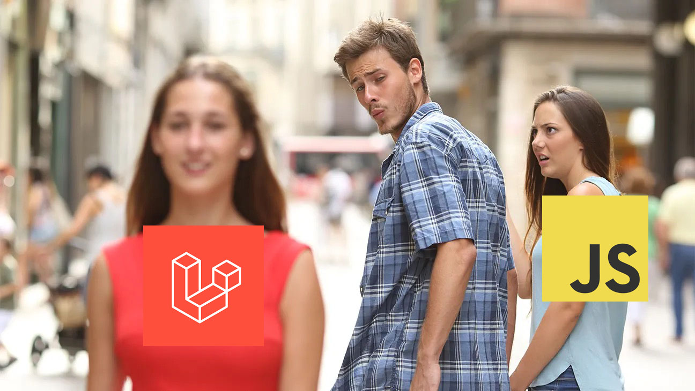
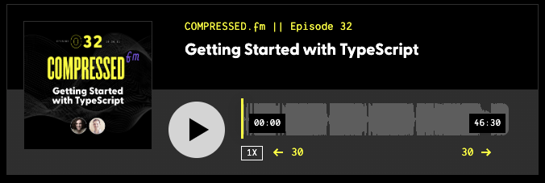
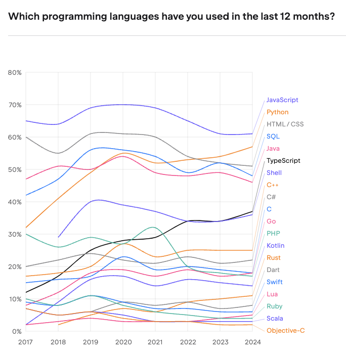
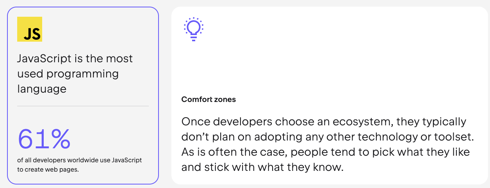
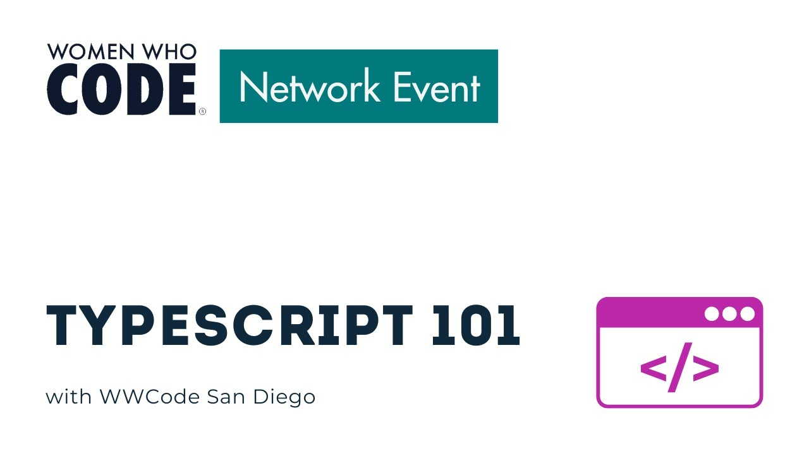

import Button from '../../../components/Button.astro';

# January 23, 2025
## 80% of TypeScript Power Comes From 20% of the Features


Hey there!

Special thanks to anyone that filled out the survey from the last email!  One of the top results was **TypeScript**. So, guess what this week's issue is all about?! … TypeScript! Following the typical( — after 1 issue can it be called typical?!) Broken Comb format, let's go wide and deep. Even though we'll start with 101, hopefully, there's something here for everyone.

> Also! If you didn't vote there's still time and I would love your feedback.
<Button href="https://www.brokencomb.dev/vote">Take the Survey</Button>
<div class="text-center my-2">or</div>
<Button href="https://www.brokencomb.dev/results" className="secondary">🍿 Show me the Results</Button>

## ;tk Heading

Lately, I've been experimenting with Laravel. That's right. Let me explain (and I'll don't worry, this comes back to TypeScript.) In the JavaScript ecosystem, we LOVE being composable. We love that we can configure our stack to be whatever we want it to be. You do you!

But, lately...


*(The shades of red even match!* 😂*)*

But lately, stuff within the JavaScript ecosystem has just been … hard. Each project comes with it's own decision fatigue. As much as we say celebrate our custom stack and composability, there is something nice about someone making those decisions for you. “This is the way.” — and *then it just works!* (This has always been part of the appeal for me with RedwoodJS. It's opinionated!)

So, I thought, “I'm a lead maintainer on the [RedwoodJS](https://redwoodjs.com) core team. People say they want the Laravel framework for JavaScript. What does that *mean?*” The only way to figure that out is to build something on Laravel and see what it has that we don't.

During this process, I realized a couple of things.

1️⃣ **There are two ways to approach development.**

(1) **Front to back.** Start with the page design. Build out what your user sees and determine how they'll will interact with your application. Then, let that inform your backend. At that point, you'll know exactly what data you need where. JavaScript shines here.

(2) **Back to front.** Start with the API. The data is king. Without the data, what is your application really? Do all the heavy lifting first. Then, when it comes time to getting it on the page, you're working with real datasets. Laravel is the hero here.

I see the value in both approaches. I'm not sure if it's my background in design and frontend, but I prefer the first method.

2️⃣ **There's tremendous value in using a single language.** I'm not sure if it's the learning curve and things would get easier with experience, but when I was using Laravel I *struggled* moving from PHP → [Blade](https://laravel.com/docs/11.x/blade) (templating language) → to [Livewire](https://livewire.laravel.com/) (think RSCs) → to [Alpine](https://alpinejs.dev/) (simplified JavaScript). That's 4 different levels! 🤯 and the syntax is slightly different with each.

But, the straw that broke the camel's back, was TYPESCRIPT! (I told you I would come around!)

PHP is a Typed language. It knows if you're using a string or a number and won't let you mix and match. PHP is a dynamically typed language, which means there is no need to tell it “This is a number,” it just knows.


JavaScript is not typed *at all*. You can have a variable that starts off as number and then turn it into a string. *Tricky.* This is one of JavaScript's biggest criticisms. But, this is also one of the things that I love the most about JavaScript. It's forgiving. It's going to try it's best to keep running. Semicolons, whatever.

TypeScript has been the response to some of those criticisms. It puts guard rails around JavaScript.

It makes me giggle a little bit when people call TypeScript a language. I mean it is, but it isn't.

> At its core, TypeScript is a superset of JavaScript.
_ from [Getting Started with TypeScript: A Comprehensive Guide for Beginners](https://medium.com/@bthncm/getting-started-with-typescript-a-comprehensive-guide-for-beginners-7a4969b6679c)

You can think of TypeScript like adjectives. It's just *describing* your variables. And TypeScript will point out when your descriptions and implementations aren't consistent.

Let me tie this back into the Laravel project I tried to build. I had a database of users. Every user has a unique ID: 1, 2, 3, 4, etc. Straightforward enough. I seeded the database with a few users and explicitly said, “This user's ID is “1”, this user's ID is “2”.  Maybe you already see where this is going?

Then, when I created a new user, I generated a  unique UUID for an ID. (UUID stands for universally unique identifier and looks like a gross string, `acde070d-8c4c-4f0d-9d8a-162843c10333`) Simple enough. 🤪

The problem was all my seeded data worked perfectly because even though it was a string, it also happened to be a number. Any new user I created had problems because it couldn't convert `acde070d-8c4c-4f0d-9d8a-162843c10333` to a number. (Well, technically, you can, but it might return an error that says the ID is too large for database)

This bug made it's way into production 😱 It looked like new users could reset their password, but couldn't login. It took me the better part of a day 🙈 to figure out why some users were having problems and others weren't.

TypeScript would have caught this *IMMEDIATELY*. It would have turned red in my code editor before I even tested it in the browser.

TypeScript has saved my bacon enough times to turn me into a die hard fan — to the point, where I don't want to work on a JavaScript project without out.

I learned TypeScript in 2021. It particularly sticks out in my mind because James Q Quick and I recorded an episode of [Compressed.fm](http://Compressed.fm) where I talked about learning TypeScript ([Episode 32](https://www.compressed.fm/episode/32)).



As soon as I learned TypeScript, I migrated the [Compressed.fm](http://Compressed.fm) site over to TypeScript. Almost immediately, it caught a bug in the custom audio player!

If you're still trying to decide. Let me share some cold hard facts. Every year, TypeScript continues to gain popularity. (Taken from [the State of Developer Ecosystem Report.](https://www.jetbrains.com/lp/devecosystem-2024/))



Also worth noting, in the same report, JavaScript is the most used programming language.


So, what are the benefits? If you're going to invest time and energy to learn something new, what do you gain in return?

## Benefits

- TypeScript catches type errors. I've already shared my horror story with database IDs (and my audio player bug).
- Auto Completion. VS Code is the IDE of choice. Even if you're using Cursor or Windsurf, these are forked from VS Code. VS Code is built on top of TypeScript, so it's a great combination and gives a better auto complete experience.
- Self Documenting. When you're coding, you can hover over functions and see exactly what parameters and the types it's expecting. There's no need to look up the function.

### Migrating to TypeScript

If this sounds convincing enough and you're interested in migrating a project, it's really a whole lot easier than you might think. When you add TypeScript to your project, you'll have a `tsconfig.json` file. Inside, there's a property for setting how “strict” TypeScript should be:

```ts
{
  "strict": true,
}
```

Setting `strict` to `true` turns “on” all the checks. Of course, you can fine tune these to your heart's desire. Documentation: https://www.typescriptlang.org/tsconfig/#strict

When I was first learning, I turned `strict` to `true` and would then let the error messages guide me. Heck, I still let them guide me.

Within TypeScript you can have implicit and explicit types. Implicit means they're implied. For example:

```ts
const myName = 'Amy';
```

TypeScript will assume that `myName` is a string because Amy is wrapped in quotes. And strings are wrapped in quotes. You can still be *explicit* and say “THIS IS A STRING” or you can let TypeScript figure it out. TypeScript will always tell you when it doesn't know.

I use implied types as much as possible. (1) It's less markup and (2) if something does change TypeScript can still figure it out. And if it catches an inconsistency, it will tell you.

If you're migrating an existing project over to TypeScript, you don't have to turn every.single.file. into a TypeScript file. JavaScript and TypeScript files can coexist. And converting an existing JavaScript file into a TypeScript file can be as simple as changing the extension from `.js`  to `.ts`.

### Two Levels of TypeScript

Over the years, I've come to recognize that there are two different levels of TypeScript:

1. TypeScript for Framework Developers and Library Maintainers
2. TypeScript for Everyone Else(TM)

You can get 80% of the way with 20% of knowledge. Let me explain.

TypeScript is *incredibly* powerful. You can write some pretty crazy code that can pick up on what you're trying to do and it will adjust it's expectations accordingly. — If you pass a string into a function, return a string. Or, if they pass a number into *that same* function, then we need to return a number. TypeScipt can handle both conditions.

As a framework developer or a library maintainer you have to take these different use cases into account. But, if you're just building your own project, everything is more straightforward. I say that to encourage you. If you've seen TypeScript code that looks like gobbly gook and ran away screaming, “Never ever will I ever.” *Your* TypeScript code for Everyone Else(TM) doesn't have to be that complicated.

## Basics

There are a handful of TypeScript primitives that you need to know.
- String
- Number (there's no `int` vs `float` )
- Boolean
- Array
- Object

I told you, literally a handful! ✋ Chances are, you're already mentally assigning types to your variables anyway!

In the example, above, I can say that `myName` is a string, by saying:

```ts
const myName: string = "Amy";
```

🍋 Easy, right? Or

```ts
let isAmazing: boolean;
```

Here, we said that `isAmazing` will be a true or false value. (Of course, it's `true`) But, if tried to assign it a value of `"maybe"` it would return an error.

If you have an array, you can simply add specify the *type* of the array and then add square brackets. For example:

```ts
const myName: string[] = ['Amy', 'Dutton'];
```

Or, another example:

```ts
const kidsAges: number[] = [7, 9, 10];
```

A value of `"teenager"` would return an error (and a problem … just kidding 😁). But, again, if there is an error, it will tell you *immediately*.

An object is similar, but instead of square brackets, you can use curly brackets.

```ts
const person: {} = {
  firstName: "Amy",
  lastName: "Dutton",
  isAwesome: true
}
```

Objects are more complex in that you can have mixed types within an object. You can be explicit about the types within the object.

```ts
const person: {
  firstName: string,
  lastName: string,
  isAwesome: boolean
} = {
  firstName: "Amy",
  lastName: "Dutton",
  isAwesome: true
};
```

If that syntax feels a little dirty, you can abstract it:

```ts
interface PersonType = {
	firstName: string,
  lastName: string,
  isAwesome: boolean
 }

 const person: PersonType {
  firstName: "Amy",
  lastName: "Dutton",
  isAwesome: true
};```

One benefit to listing it out separately, is now you can `export` `PersonType` and use it within another file. This helps keep data consistent across multiple files!

A sixth type is a function. (This destroys my “handful” 🖐️ of types, unless of course we're talking about the 6th finger man)


Let's create a function called isPodcasting. I can specify that it's a function by using an empty arrow function `() => {}`

```ts
interface PersonType {
	firstName: string,
  lastName: string,
  isAwesome: boolean,
  isPodcasting: () => {}
 }

 const person: PersonType = {
  firstName: "Amy",
  lastName: "Dutton",
  isAwesome: true,
  isPodcasting: (dayOfWeek) => {
    if (dayOfWeek === "Wednesday") return true;
    return false;
  }
};
```

Just like objects can have multiple types, functions can have different types. You can pass in a string or a number or a boolean and get back something completely different. We can explicitly define that too:

```ts
interface PersonType {
	firstName: string,
  lastName: string,
  isAwesome: boolean,
  isPodcasting: (dayOfWeek: string) => boolean
 }

 const person: PersonType = {
  firstName: "Amy",
  lastName: "Dutton",
  isAwesome: true,
  isPodcasting: (dayOfWeek) => {
    if (dayOfWeek === "Wednesday") return true;
    return false;
  }
};
```

Hey-O! You're a TypeScript developer now!

If you want to go a little bit deeper, I did a session for Women Who Code. Even though this was two years, all the content is still current and relevant.

### TypeScript 101

[https://www.youtube.com/watch?v=GTYEgd3Q7xw](https://www.youtube.com/watch?v=GTYEgd3Q7xw)

## 🔍 Essential Resources That Helped Us

1. Matt Pocock's TypeScript Tips ([@mattpocockuk](https://twitter.com/mattpocockuk))
  - Matt posts some great “Hot Tips” on [Twitter](https://x.com/mattpocockuk)/[Blue Sky](https://bsky.app/profile/mattpocock.com) that easily digestible
  - [Total TypeScript VS Code Extension](https://www.totaltypescript.com/vscode-extension) - Matt also created a TypeScript extension that does a good job of educating different TypeScript principles within your project, as well as, “translating” TypeScript error messages, making them easier to understand.
  - Matt partnered with egghead to create [Total TypeScript](https://www.totaltypescript.com/). It is the most comprehensive course I've ever seen on TypeScript. It's worth checking out, especially if you want to go *deep*.
  - Matt also some free, [introductory material on TypeScript](https://www.totaltypescript.com/tutorials/beginners-typescript). This includes challenges are great for getting “hands on experience” and testing your knowledge.
2. [Execute Program's TypeScript Course](https://www.executeprogram.com/courses/typescript)
  - This course includes Interactive exercises at the beginner, mid, and advanced levels.
3. [Microsoft's Official TypeScript Handbook](https://www.typescriptlang.org/docs/handbook/intro.html)
  - This is the official TypeScript documentation. I know sometimes documentation can be overwhelming, especially if it's a new technology, but Microsoft has done a great job of making this handbook readable and easy to understand.

> Next week, we'll take a look at:
> 👉 Real examples from React components
> 👉 Common type patterns in React
> 👉 Handling component props and state
> 👉 Type inference best practices

---

## 👁️ Things I Have my Eye On

1. Lenny was a former product lead at AirBnB. Now, he's an Angel Investor for the who's who of Silicon Valley. He has a podcast ([Lenny's Podcast](https://www.lennysnewsletter.com/podcast)) and a [SubStack](https://www.lennysnewsletter.com/) *full* of resources. Recently, he (and his team) surveyed 6,500 tech professionals on the tools they use. **What's in your stack: The state of tech tools in 2025** is an interesting read. Not surprisingly, the biggest difference in tooling over the last few years has been with AI.

https://www.lennysnewsletter.com/p/d1a45ac5-43b6-4943-a7fd-9ccbab54eacd

1. I'm a huge fan of Adam Argyle. One, he's just a fun person, but two, he does a great job of explaining things and making really boring and tedious concepts fun and engaging. Recently, he wrote a post called 6 CSS Snippets Every Front-End Developer Should Know in 2025. So, of course, I clicked. No leaving me behind!

https://nerdy.dev/6-css-snippets-every-front-end-developer-should-know-in-2025

- Side note: I need to spend time with the HTML Dialog element. Adam mentioned it in his article and I've seen it mentioned multiple times (Frontend Masters [here](https://frontendmasters.com/blog/basic-dialog-usage-and-gotchas-to-watch-for/) and [here](https://frontendmasters.com/blog/animating-dialog/)), including this article from Cassidy Williams ([A Couple of CSS tricks of Dialog Elements](https://cassidoo.co/post/css-for-dialogs/)).

1. Speaking of Cassidy, she shared a link in her newsletter for the Top Pens of 2024. I'll admit, my first thought was “Yeah! A pen snob, just like me.” But these are CODE Pens and so inspirational.  . Also, let's take a minute to recognize how many of Jhey's pens are featured. 👏

https://codepen.io/2024/popular/pens/

1. I mentioned Tailwind v4 in the last email. [Now, it's officially released](https://tailwindcss.com/blog/tailwindcss-v4). TBH, I'm still trying to decide how I feel about all the custom properties/variables. But, like most things, I need to build a project before I can get a true feel for the updates.

---

# Feedback

I would still love your feedback on this newsletter. I'm still trying to settle into a format and I want to ensure that it's moving in the right direction.

When I was a newly wed, I told my husband, “If you don't like something I cook, you better tell me now, otherwise you're going to eating it the rest of your life.” — The same concept applies here. Speak now or forever hold your peace. 😂

Feel free to reply directly to this email or fill out [the feedback form](https://www.brokencomb.dev/feedback/2) ABC style:

- *Awesome* - What's Great?
- *Boring* - What's unengaging?
- *Confusing* - What's unclear?
- and anything else?

